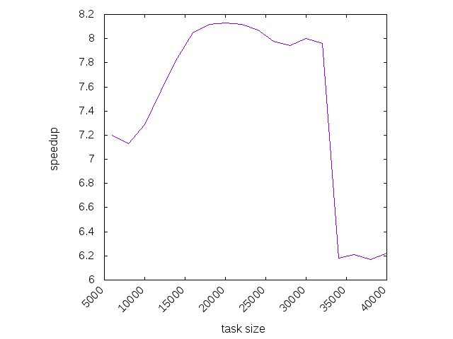

# High Performance Computing project
## by Federico Bozzini

## Project goals

For this assignment, the [**Mandelbrot set**](https://en.wikipedia.org/wiki/Mandelbrot_set) assignment, it is required to load the balance implementing a "farm" structure of processes, with a dispatcher process distributing the tasks and a number of worker processes receiving tasks and computing responses.  The farm will balance the load by dividing the work into a number of small tasks -- the optimal task size will emerge from the performance evaluation. In order to hide latency between dispatcher and each slave, the dispatcher will initially send more than one task to each slave; subsequent tasks are sent to slaves, one per received response, until completion.

Choose a reasonable number of problem sizes and, for each of them, provide a plot of the speedup vs. granularity of task decomposition, having fixed the number of processors to the maximum available on the platform; the goal is to show the benefits of the implemented load balancing technique and to find the optimal task size.

## Project design

The solution that I designed is based on three different programs and some scripts to assist with the execution and performance measurements.

### Sequential mandelbrot set

The first program is an implementation of the mandelbrot set that, given a region in the cartesian plane and a resolution, calculates the mandelbrot set for that region. More specifically this program, once compiled, may be run with the following command:

    mandelbrot_seq <rows> <cols> <x0> <y0> <dx> <dy>

Where:

*rows* and *cols* are the parameters that set the resolution.

*x0* and *y0* are the coordinate of the top-left corner of the rectangle.

*dx* and *dy* are the sizes of the rectangle, respectively the horizontal and vertical one.

This program creates a simple array of size *rows X cols* as a grid that represents the rectangle at the given definition. Then it calculates the mandelbrot set and writes a result to a file *mandelbrot_seq.dat" where the first row are the arguments of the program and the other rows encode *rows* X *cols* grid. The execution time is calculated and printed to stdout. To ensure a correct assessment of the performances, the algorithm is run several (*TRIALS*) times and only the best execution time is recorded.

The calculation is done with a single loop cycling through all the points in the main array and calculating the point by point value of the mandelbrot set. Every point can be processed autonomously and this is a big hint that this algorithm is highly parallelizable.

### *OpenMP* mandelbrot set

The second program is very similar to the first one. Once compiled, it may be run with the command:

    mandelbrot_omp <rows> <cols> <x0> <y0> <dx> <dy>

where the arguments are the same of the sequential version and the only difference in output is that the output file is named *mandelbrot_omp.dat"

This version uses the *openMP* constructs (or *pragmas*) to parallelize the main loop across all the threads available.

### *MPI*+*OpenMP* mandelbrot set

The thid program is somehow similar to the first one and the second one, but only in its inputs and outputs. Once compiled, it may be run with the command:

    mandelbrot_mpi <rows> <cols> <task_size> <x0> <y0> <dx> <dy>

where the arguments are the same of the sequential version with the addition of *task_size*.

This program uses the *MPI* library to divide the workload among the nodes in a cluster. It uses *n+1* instances of the program, where *n* is the number of slaves or worker nodes and 1 is the master node, or coordinator. Hence the program code is logically divided in two parts, one for each node type.

The coordinator keeps an index (*task_idx*) in memory that is increased by *task_size* until it reaches *rows* X *cols. Every time it is increased, a message is sent to a worker node with its value, and the worker nodes calculates the mandelbrot set on the region going from *task_idx* to *task_idx* + *task_size*. The result (a subset of the main array) is then sent to the coordinator, that gives a new task back to the worker node. The coordinator also keeps track of all the tasks sent to the workers, and when the number reaches 0, the mandelbrot set is completed and a final message (with a different *MPI* tag) is sent to all the workers to communicate that the program is completed. To avoid leaving the workers waiting for tasks for too long, at first the coordinator sends *m* (=2) task to every worker node at the begining.

### The program runners

Three scripts were added to help launching the programs: *run_seq.sh*, *run_omp.sh*, *run_mpi.sh* .

They compile the associated program and launch it with some sensible default arguments. The user can also supply some arguments. The *run_mpi.sh* script allows the user also to specify a number of nodes to be used.

### The correctness checkers

Two script, *check_omp.sh* and *check_mpi.sh*, were added to ensure that the results given by the parallel scripts match the results of the sequential version.

The program *mandelbrot_seq* is assumed to be corret since the results when plotted correspond to the expected results.

### The performance meters

Two scripts were added to measure the performances of the *MPI* version of the program and the speedup obtained compared to the sequential verson: *compare_task_sizes.py* and *compare_nodes.py*.

### Task sizes comparison

The *compare_task_sizes.py* can be run with the following command:

    ./compare_task_sizes.py <rows> <cols> <task_size_min> <task_size_max> <task_size_step>

Where:

- *rows* and *cols* are the size of the problem (the rectangle in the cartesian plan is fixed).
- *task_size_min*, *task_size_max* and *task_size_step* are used to create a list of task sizes to run the script with.

What the script does is running the sequential version of the program and measuring its execution time. After that, the task sizes (generated by using the input arguments) are used to find the optimal task_size and make a plot of the speedups for every task size compared to the sequential version.

### Number of nodes comparison

The *compare_nodes.py* can be run with the following command:

    ./compare_nodes.py <rows> <cols> <task_size_min> <task_size_max> <task_size_step>

Where:

- *rows* and *cols* are the size of the problem (the rectangle in the cartesian plan is fixed).
- *task_size_min*, *task_size_max* and *task_size_step* are used to create a list of task sizes to run the script with.

What the script does is running the sequential version of the program and measuring its execution time. After that, for every number of nodes going from 2 up to N (number of nodes in the cluster + 4), the task sizes (generated by using the input arguments) are used to find the optimal task_size for that number of nodes and make a plot of the speedups for every node number compared to the sequential version. The additional number of nodes compared to the ones available in the cluster are used to show that the performance cannot be increased by using more nodes that the ones that are available.

### Plot generations

A few gnuplot scripts were added to generatethe performance wrt task sizes plot, the performances wrt nodes num plot and mandelbrot set plot. These scripts are *perf.gnu*, *compare.gnu*, *mandelbrot_seq.gnu* and *mandelbrot_mpi.gnu*.

## Results

### The hardware configuration

The tests were made on a cluster of 10 nodes with 2 cores.

### Software compiling options

All the c programs were compiled with the following command:

    gcc mandelbrot_omp.c -fopenmp -O3 -o mandelbrot_omp

The MPI program was compiled with the following command:

    mpicc mandelbrot_mpi.c -fopenmp -lm -O3 -o mandelbrot_mpi

### The tests

The first test were done to find the optimal task size (and more in general the optimal task size range) for the MPI version of the program.

### Expectations

By running the *OMP* version of the program on a 2 core node the speedup was generally (depending on the task size) slightly smaller than 2 (1.9 or 1.8). A few tests made on a 6 cores server showed a speedup around 5.4. In theory when using n node with *MPI* the expectations where of a *n - 1* speedup. Hence in theory the maximum possible speedup was around 2 X (n -1) X 10 = 18. Due to the parallelization overhead I exepcted a lower level of parallelism.

#### Test 1 - Optimal task size with a 100 X 100 grid

The first test was made to find the optimal task size for a grid with a very small size (100 X 100). To run the test I used the command:

    ./compare_task_sizes.py 100 100 100 10000 100

The results were extremely noisy and the speedup very modest. At this scale is pretty clear the *MPI* is not very beneficial. The best speedup (3.5) is obtained with a task size of 500.

#### Test 2 - Optimal task size with a 500 X 500 grid

The second test was made to find the optimal task size for a grid with a larger size (500 X 500). To run the test I used the command:

    ./compare_task_sizes.py 500 500 100 10000 100

The results were more consistent compared to the first test. At this scale  *MPI* gives better results. The best speedup (7.79) is obtained with a task size of 2200.

#### Test 3 - Optimal task size with a 1000 X 1000 grid

The third test was made to find the optimal task size for a grid with an even larger size (1000 X 1000). To run the test I used the command:

    ./compare_task_sizes.py 1000 1000 1000 40000 1000

The results were similar to the second test. The best speedup (8.01) is obtained with a task size of 2000.

I decided to better inspect the results around this size by reducing the step size and the task size range. By running the command:

    ./compare_task_sizes.py 1000 1000 100 8000 200

The best speedup (8.03) is obtained with a task size around 2500. Quite similar to the previous measurement.

#### Test 4 - Optimal task size with a 2000 X 2000 grid

The fourth test was made to find the optimal task size for a grid with a size of 2000 X 2000. To run the test I used the command:

    ./compare_task_sizes.py 2000 2000 1000 20000 2000

The best speedup (8.1) is obtained with a task size of 7000.

I decided to better inspect the results around this size by reducing the step size and the task size range. By running the command:

    ./compare_task_sizes.py 2000 2000 7000 15000 500

The best speedup (8.14) is obtained with a task size around 8000. There is only a small improvement due to the previous measurement, probably due to chance.

#### Test 5 - Optimal task size with a 5000 X 5000 grid

The fifth test was made to find the optimal task size for a grid with a size of 5000 X 5000. To run the test I used the command:

    ./compare_task_sizes.py 5000 5000 1000 40000 2000

The best speedup (8.1) is obtained with a task size of 11000.

#### Test 6 - Optimal task size with a 10000 X 10000 grid

The sixth test was made with to find the optimal task size for a big grid with a size of 10000 X 10000. To run the test I used the command:

    ./compare_task_sizes.py 10000 10000 6000 40000 2000

The best speedup (8.13) is obtained with a task size of 20000.

### Task size tests - comments

It is very clear that with a growing size of the grid the level of parallelism achieved is not increased. The optimal task size increases in an almost linear way compared to the size of the problem, probably indicating that there is a balance between the optimal task size of the workers and the computational work that the coordinator is able to do. The coordinator is almost surely the bottleneck of the application.

#### Test 7 - Scaling with a 100 X 100 grid

The seventh test was made to analyze the scaling of the MPI program with a size of 100 X 100. To run the test I used the command:

    ./compare_nodes.py 100 100 100 4000 100

Th best speedup (4) is achieved with with a number of nodes equals or greater than 6. This shows that at this very small size the program is not able to exploit a parallelism greater than the one achieved with 6 nodes. It's important to  node that when the number of nodes used is greater than the real number of nodes available, there is a penalty in the performances. 

#### Test 8 - Scaling with a 500 X 500 grid

The eighth test was made to analyze the scaling of the MPI program with a larger size of 500 X 500. To run the test I used the command:

    ./compare_nodes.py 500 500 100 4000 200

Th curve obtained in this case is a much better representation of the behavior of the *MPI* program changing the number of cores. With one worker node there is a speedup of 1.61 (due to *openMP*) that almost doubles with 2 workers nodes and grows sublinearly when adding new nodes, until at least 7 workers nodes are used and then the speedup stabilizes to a maximum of 8.

#### Test 9 - Scaling with a 1000 X 1000 grid

The ninth test was made to analyze the scaling of the MPI program with a larger size of 1000 X 1000. To run the test I used the command:

    ./compare_nodes.py 1000 1000 100 5000 500

Th curve obtained in this case is very similar to the one obtained with test 8. It may be a good signal that the *MPI* program doesn't scale well with more than 7 nodes regardless of the size.

#### Test 10 - Scaling with a 2000 X 2000 grid

The tenth test was made to analyze the scaling of the MPI program with an even larger size of 2000 X 2000. To run the test I used the command:

    ./compare_nodes.py 2000 2000 5000 12000 1000

Th curve obtained in this case is very similar to the one obtained with test 8 and 9 with even slighly better performances.

#### Test 11 and Test 12 - Increasing the number of nodes

Other two tests were done by adding other 8 nodes to the cluster (for a total of 18), potentially (almost) doubling the performance of the *MPI* program. The eleventh test was run with:

    ./compare_task_sizes.py 1000 100 1000 40000 1000

while the twelveth was run with:

    ./compare_task_sizes.py 2000 2000 1000 20000 2000

So they respectively mirrored the tests number 3 and 4. The results were very similar to the previous tests as well.

#### Test 13 - Scaling with a 2000 X 2000 grid and 18 nodes

The last test made was to analyze the behavior of the *MPI* program with a variable number of nodes when 18 are available. The grid used had size 2000 X 2000.

The results were the ones shown in the following figure:

It's pretty clear that the performances of the program don't improve with a number of workers greater than 8.

### Other tests

Another test I made was to measure how the workload was distributed among the workers, keeping track of a task completed by each one of them. The results were excellent, showing that the workload was distributeed extermely evenly. The code has been removed from the final version of the program.

## Conclusions

The *MPI* version of the program works and the speedup achieved with a low number of nodes were in line with the expectations. As the number of nodes increased the performance degrade up to the point that when using more than 7 nodes there wasn't any meaningful performance gain. The scalability of the program is therefore good but not excellent and definitely be improved.

## Possible improvements

A first test could be to parallelize with *openMP* the work of the coordinator once a completed task is received. The master thread could go on in checking if sending another task could be sent to the worker while a slave copies the result to the grid of results.

Another possibile and more radical change of the application could be to reimplement the logic of the *MPI* application using the non-blocking functions (*MPI_Isend*, *MPI_Irecv*) to increase the level of parallelism. This could be useful both in the coordinator (avoiding waiting for the copy of the finished task results) and for the workers to keep a queue of tasks to operate on.